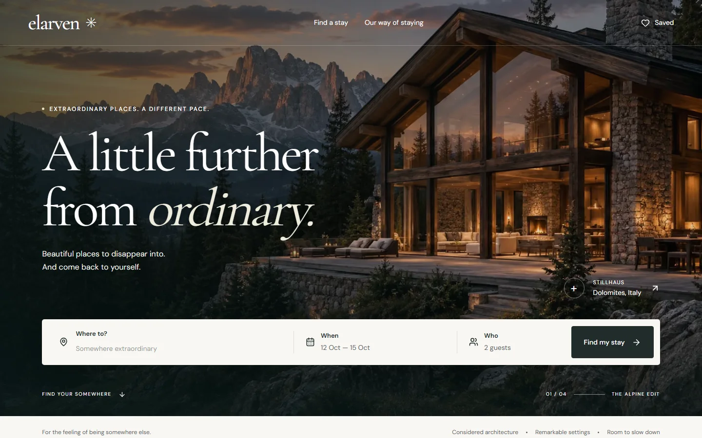
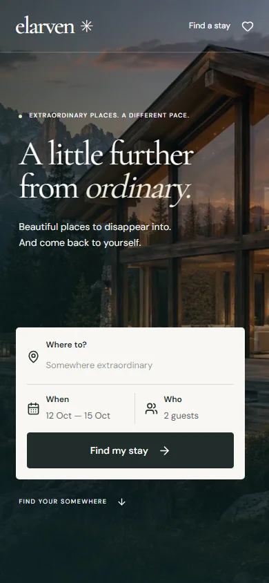

# Elarven

Exceptional boutique stays, thoughtfully discovered. An editorial travel experience with a complete, tested frontend reservation journey.





## The product

Choosing a distinctive stay should feel inspiring without making dates, capacity or prices hard to understand. Elarven connects landscape-led discovery to practical decisions: destination → dates and guests → filtered results → property details → reservation review and local confirmation.

This is frontend product engineering, not only a landing page. Twelve fictional accommodation options across four real regions have typed capacity, amenities, cancellation rules, blocked nights and derived EUR pricing. The interface supports:

- Destination autocomplete, date validation and adult/child steppers.
- Shareable URL search, combined filters, sorting, removable chips and empty-state recovery.
- List view and an original illustrative map with synchronized pins and selected stays.
- Saved stays that survive reloads, an immersive keyboard-operable gallery, share feedback and related stays selected by landscape.
- Sticky booking controls, visible fees, rate options and totals that respond to nights and guests.
- Validated contact details, review, local confirmation, and recovery after a confirmation-page reload.
- Missing-property, application-error and image-fallback states.

## Run locally

Use Node.js 22.18 or newer in the Node 22 line and npm. No API key or account is needed.

```sh
npm ci
npm run build
npm run start
```

Open <http://127.0.0.1:3000>. For development, use `npm run dev`. Set `NEXT_PUBLIC_SITE_URL` to the eventual public origin before deploying; it defaults to localhost for metadata.

The production launcher preserves the standalone build configuration, copies static/public assets into generated output, and starts its server on localhost. It does not modify source assets.

## Implementation

Next.js 16 App Router, React 19, strict TypeScript, Tailwind CSS 4, Lucide icons and Zod. DM Sans and Cormorant Garamond are self-hosted through `next/font/local`. Native dialogs and date inputs provide platform behavior; small CSS transitions avoid a heavy animation dependency. React state and a small provider are sufficient for this scope.

| Location                 | Responsibility                                                             |
| ------------------------ | -------------------------------------------------------------------------- |
| `src/app`                | Server route composition, metadata, global styles, errors and social image |
| `src/components`         | Focused interactive client components and presentation                     |
| `src/lib/stays.ts`       | Typed catalog and thin `stayRepository` replacement boundary               |
| `src/lib/domain.ts`      | Pure date, guest, price, filtering and URL rules                           |
| `src/lib/reservation.ts` | Typed contact validation                                                   |
| `tests`                  | Domain/component tests and browser journeys                                |
| `scripts`                | Visual checks, Lighthouse measurement and Reel rehearsal                   |

Server-rendered content is the default. Home resolves its initial dates per request so a build crossing midnight cannot create a hydration mismatch. Search state belongs in URLs; only saved property IDs belong in localStorage. Contact details remain in memory and are cleared after confirmation. No personal information is sent to a service or persisted by the app.

The map is deliberately illustrative, with no tile service or runtime key. Four fictional retreats each offer three accommodation options; each retreat shares two representative images. The gallery is lightweight and mounts its full-size media only when opened; the map is dynamically imported.

## Craft and accessibility

The design pairs architecture imagery, ivory surfaces, deep ink and terracotta actions with an expressive serif. Mobile uses a separate portrait hero crop and its own search and sticky-action layouts. Two polish passes addressed composition and then interaction consistency, focus, fees and rendering performance.

Semantic landmarks, a skip link, visible focus, native modal isolation, explicit focus trapping/restoration, Escape dismissal, labelled errors, live save feedback and reduced-motion styles support the critical journey. Native date controls preserve keyboard/device calendar support. Automated axe scans cover five routes; keyboard browser checks cover dialogs, gallery and form errors. These checks are not an accessibility certification or a substitute for assistive-technology user testing.

## Verification

```sh
npm run format:check
npm run lint
npm run typecheck
npm test
npm run build
npx playwright install chromium
npm run test:e2e
```

The E2E configuration starts the production server when needed. With a production server already running:

```sh
node scripts/visual-check.mjs
node scripts/audit.mjs
node scripts/showcase.mjs
```

See [the quality report](docs/quality-report.md) for actual results, audit conditions and remaining limits. Machine-readable [Lighthouse results](docs/performance-results.json) and [responsive checks](docs/screenshots/verification.json) are retained. Raw audit reports, PNG captures, videos and test traces are generated locally and ignored by Git.

Verified locally: clean dependency installation, lint, TypeScript, **30 unit/component tests**, **12 E2E/accessibility tests**, and the production build. The six required viewport sizes have 24 route/layout checks with no overflow or broken images. Browser coverage also verifies that the standalone image optimizer serves resized assets.

Final Lighthouse 12.8.2 homepage audit on local production: **88 mobile / 100 desktop Performance**, and **100 Accessibility, Best Practices and SEO** on both. Mobile LCP is 3.02s, TBT 289.50ms, CLS 0; desktop LCP is 0.73s, TBT 12ms, CLS 0. Fresh headless Chromium profiles use standard simulated mobile throttling and Lighthouse's official desktop settings, with a warm local server. Mobile misses the 90 target by two points; remaining rendering/main-thread costs are documented in the quality report. These are lab results, not field performance claims.

CI installs dependencies, checks formatting/lint/types, runs unit tests, builds, installs Chromium and runs E2E tests. The workflow is configured but has not run on GitHub: publication is deferred at the owner's request.

## Decisions and provenance

- [Research, positioning and design tokens](docs/research-and-direction.md)
- [Fictional data, price references and fee assumptions](docs/data-provenance.md)
- [Asset inspection, generation, transformations and licenses](docs/asset-credits.md)
- [25–30 second Reel shot list and rehearsal](docs/reel-capture.md)

Optimized original AI-generated architecture imagery ships locally. The six supplied videos were inspected and preserved; they are not redistributed. Font/icon license notices are included. No blanket project license is asserted before the intended copyright holder chooses one.

## Honest boundaries and next phase

This is a frontend concept with local seeded data, fictional ratings, fixture availability and simulated in-memory confirmation. Rates are researched editorial bands, not live quotes. There is no authentication, database, payment, reservation transmission or transactional email. Reloading confirmation intentionally loses the local confirmation state. Saved IDs are local to one browser. No real property booking is made.

A future implementation can replace the repository boundary with an API and PostgreSQL, then add authentication/authorization, server-owned availability with transactional inventory holds, server-side validation and authoritative fee rules. Payment intent/webhook idempotency, email delivery, audit logging, observability and recoverable booking status must be designed together before accepting real reservations. None of that future work is represented as implemented here.
